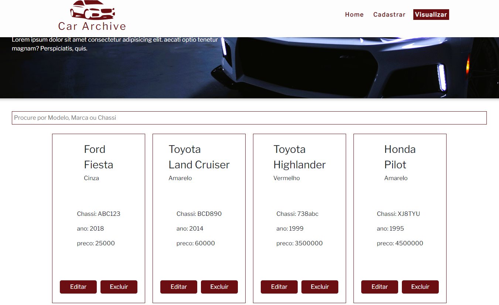

# Sobre o Projeto
Este projeto foi desenvolvido como parte de um teste técnico para a etapa de seleção de estagiário em Desenvolvimento Web Full Stack. O escopo do teste envolveu a criação de uma aplicação completa, abrangendo tanto o frontend quanto o backend.


- [Instruções para rodar o projeto](#instruções-para-rodar-o-projeto)
  
- [Telas](#telas)

  
### Objetivo
O objetivo principal deste projeto era demonstrar habilidades no desenvolvimento web utilizando tecnologias modernas, especialmente React TSX para o frontend e Node.js com Express e Mongoose para o backend. A tarefa consistia em construir uma aplicação para o gerenciamento de veículos, oferecendo funcionalidades como cadastro, edição, visualização, pesquisa e exclusão de registros.
Se você está revisando este repositório como parte do processo seletivo, agradeço pela oportunidade e fico à disposição para quaisquer dúvidas ou informações adicionais sobre a implementação.

A aplicação possui três telas principais:

1. **Home**: Tela de entrada na aplicação, o usuário pode escolher entre navegar para as telas que desejar através do contéudo no centro da página ou do menu de navegação no canto direito superior.

2. **Cadastro**: Nesta tela, os usuários podem criar novos registros de veículos, os formulários possuem validação com Formik e esquema com Yup, também há um feedback para o usuário em relação a criação do novo registro.

3. **Visualizar**: Nesta tela, os usuários podem visualizar os registros criados, pesquisar dinamicamente por registros usando Marca, Modelo ou Chassi do veículo, e deletar os registros, em todas etapas há feedback para o usuário do sucesso da ação bem como confirmação das ações de edição e exclusão.


## O Backend Express.js 

A Conexão com o banco de dados MongoDB é feita através de "mongodb://127.0.0.1:27017/carros" .
          
#### |Get|  http://localhost:3001/api/v1/cars
Retorna todos os carros cadastrados.

#### |Post| http://localhost:3001/api/v1/create-car
 recebe os dados do véiculo {Marca, Modelo, Cor, Chassi, Preço, Ano} no corpo da requisição e cria um novo registro.
 
#### |Put| http://localhost:3001/api/v1/edit-car/:chassi
recebe através de param na url da requisição o dado do carro a ser editado, no body os dados a serem alterados {Marca, Modelo, Cor, Chassi, Preço, Ano}.

#### |Delete| http://localhost:3001/api/v1/delete-car/:chassi
recebe através de param na url da requisição o dado do carro a ser deletado.

## O Frontend React 
 
 - o projeto foi criado com Vite.
 - Foi usado a versão Typescript do React.
 - Estilização em Styled Components e há um modal do Bootstrap. 
 - Validação com Formik e esquema de validação com Yup. 
 - Rotas foram feitas com React Router Dom.
 - Transações http com axios.  
 - Hooks: useState, useEffect, useContext, useMemo.


# Instruções para rodar o Projeto

### pre-requisitos

[Node](https://nodejs.org/en/)

[MongoDB](https://www.mongodb.com/products/tools/compass)


## BackEnd


- Basta clonar, ou fazer [donwload](https://github.com/Lmsilvano/logikee_cadastrodecarros_fullstack/archive/refs/heads/main.zip) deste repositório;


- #### a Api node está configurada para se conectar através de "mongodb://127.0.0.1:27017/carros" portanto é necessário se certificar de que o MongoDB está online na porta padrao 27017 e que tenha um banco "carros" cadastrado, se preferir altere a string de conexão do banco em: backend/database/config.js

- No diretório /backend, abra o terminal de sua preferência e execute:
```bash
npm install
```
Isso instalará todas as dependências necessárias para o projeto.

-  | Passo Opcional | Em seguida, mantendo-se no diretório /backend popule o banco de dados com novos registros: 
```bash
node seed.js
```
- Ainda no diretório /backend, execute o servidor
```bash
npm run dev
```

## FrontEnd
 - no diretório /fronted/autoarchive/ deste projeto, abra o terminal de sua preferência e execute:
```bash
npm install
```
Isso instalará todas as dependências necessárias para o projeto.

- Após a instalação das dependências, ainda no diretório /frontend/autoarchive execute o servidor de desenvolvimento:
```bash
npm run dev
```

## Telas:
### Home


### Visualizar


### Cadastrar
---


